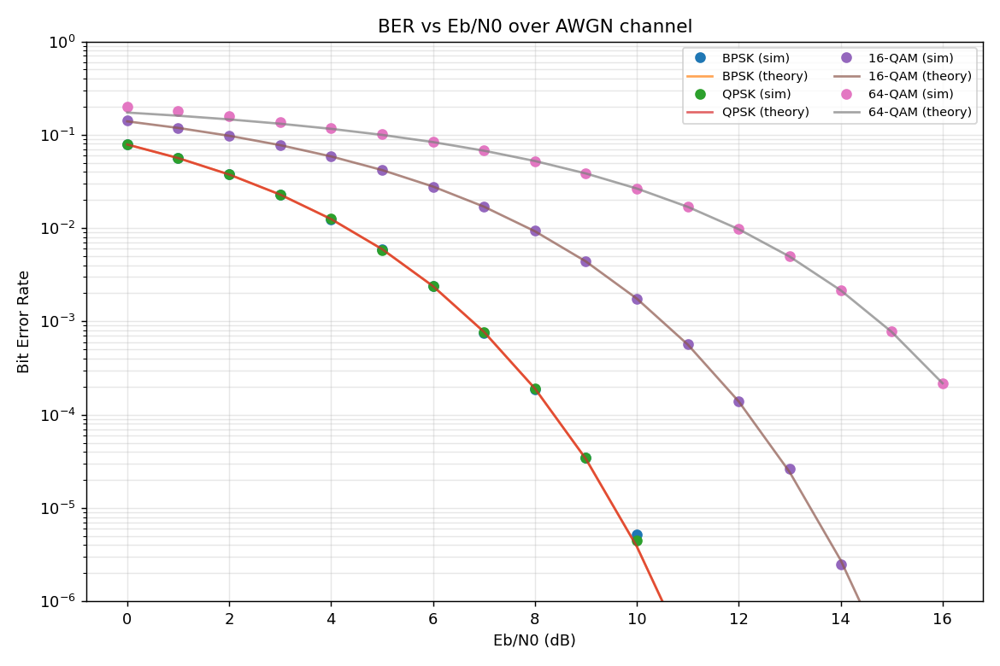
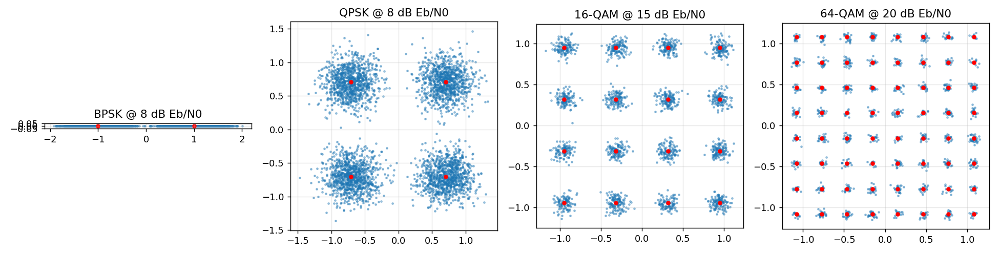

# Digital Modulation BER Simulator

Monte-Carlo simulation of **BPSK, QPSK, 16-QAM and 64-QAM** over an AWGN channel with Gray mapping. Simulated bit error rates are plotted against the theoretical curves, and constellation diagrams show the effect of noise.

## Run
```bash
pip install -r requirements.txt
python src/modulation_ber.py
```
Outputs `results/ber_curves.png`, `results/constellations.png` and a console table.

## How it works
1. Random bits -> Gray-coded symbols, normalised to unit average symbol energy.
2. Complex AWGN added with N0 = Es / (log2(M) * Eb/N0).
3. Minimum-distance (nearest level) detection per I/Q axis.
4. BER counted and compared with theory:
   - BPSK/QPSK: `Q(sqrt(2 Eb/N0))`
   - Square M-QAM (approx.): `(4/k)(1 - 1/sqrt(M)) Q(sqrt(3k Eb/N0 / (M-1)))`

## Sample output
```
 Eb/N0 |      BPSK |      QPSK |    16-QAM |    64-QAM
     0 |  7.87e-02 |  7.85e-02 |  1.41e-01 |  2.00e-01
     4 |  1.24e-02 |  1.26e-02 |  5.89e-02 |  1.19e-01
     8 |  1.87e-04 |  1.91e-04 |  9.33e-03 |  5.23e-02
```
BPSK at 0 dB gives 7.87e-02 against a theoretical 7.86e-02, so the simulator matches theory.




## Takeaways
- BPSK and QPSK have the same BER per bit, but QPSK carries twice the data in the same bandwidth.
- Higher-order QAM packs more bits per symbol but needs much more Eb/N0 for the same BER. This is the trade-off behind adaptive modulation in Wi-Fi and LTE/5G.
- Points where the simulation hits 0 errors are limited by the number of simulated bits, not by the system being perfect.

## Ideas to extend
- Add Rayleigh fading and compare with AWGN.
- Add convolutional coding or Hamming codes and show the coding gain.
- Add pulse shaping (raised cosine) and plot an eye diagram.
